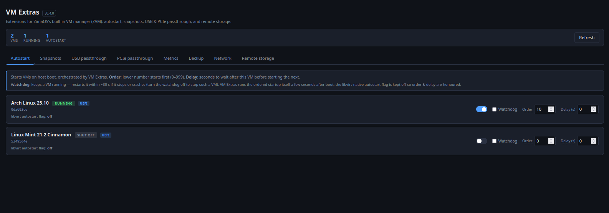
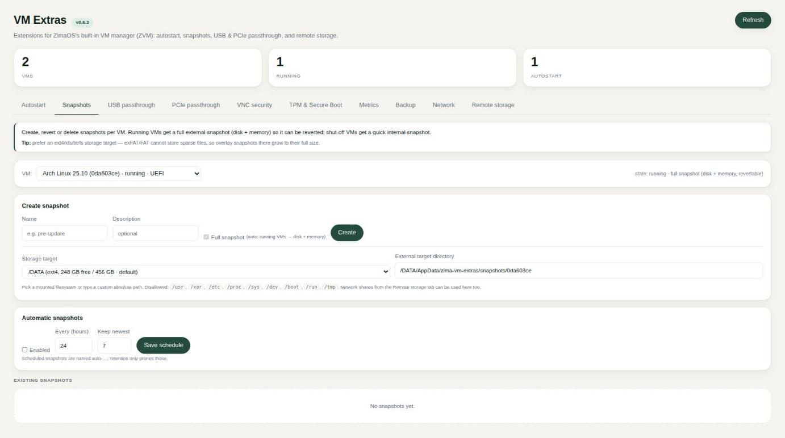
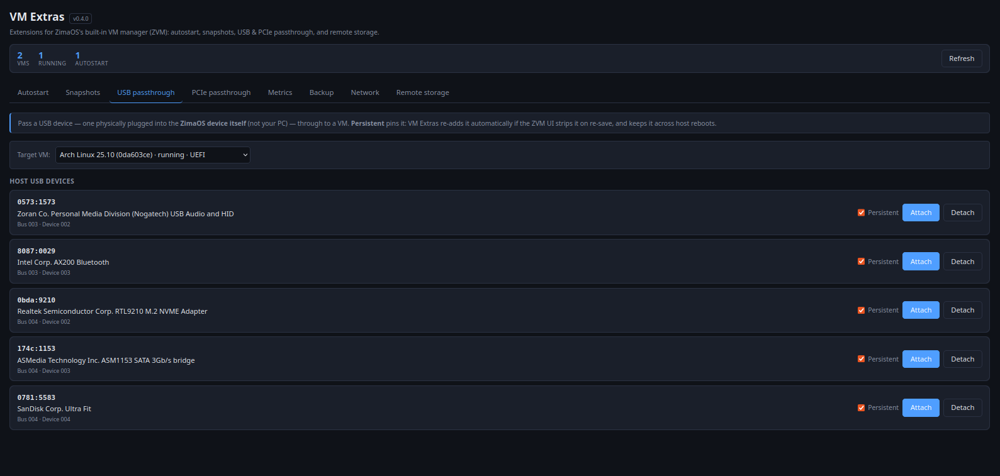

# zima-vm-extras

Community add-on for ZimaOS's built-in **ZVM** (Zima Virtual Machine) module.
It adds the day-to-day operational features the official UI lacks, without
touching the ZVM frontend — it installs as a separate `zima_vm_extras.raw`
sysext with its own **VM Extras** tile on the ZimaOS dashboard.

> Status: **v0.6.0** — verified on ZimaOS **1.7.0-beta1** (kernel 6.18.9,
> virtqemud / libvirt 10, qemu 9).
>
> **v0.6.0 adds the TPM & Secure Boot tab.** Windows 11 refuses to install
> without a TPM 2.0, and ZVM creates every domain without one — even though
> ZimaOS ships the `swtpm` emulator, `virsh domcapabilities` reports the
> emulator backend with versions 1.2 and 2.0, and `/usr/share/qemu` carries a
> firmware image literally named `edk2-x86_64-secure-code-win11.fd`. The
> ingredients are all there and nothing wires them up. This tab adds
> `<tpm model='tpm-crb'><backend type='emulator' version='2.0'/></tpm>` to the
> domain and pins it, so a ZVM re-save cannot silently drop it again.
>
> **v0.5.x adds the VNC security tab.** ZVM generates every VM's console as
> `<graphics type='vnc' listen='::'>` with **no password**, so anyone on the
> LAN can take over a VM's screen and keyboard with a plain VNC viewer. This
> tab sets a console password on the domain and a reconciler keeps it there
> when ZVM re-saves the domain and strips it. The password applies at the VM's
> **next start** — `virsh define` rewrites the persistent config and never
> disturbs a running VM.
>
> **v0.5.1** fixes the read-back of that password: `virsh dumpxml` masks the
> `passwd` attribute unless it is given `--security-info`, so a protected
> console reported itself as *unprotected* — the tab showed the wrong state and
> the reconciler re-defined the domain once a minute forever, because the
> password it had just written kept reading back as absent.
>
> **v0.5.2** stops the tab from reporting a console as safe while it is still
> open. The password goes into the persistent config, which the running qemu
> never re-reads, so between setting it and the next VM start the config says
> "protected" while the live console still lets anyone in. The tab now reads
> the running domain separately and shows three states: **exposed** (no
> password anywhere), **restart required** (saved, but the running console
> started without it), and **password set** (the live console really does ask
> for one).

## Features

| Tab | What it does |
|-----|--------------|
| **Autostart** | Starts VMs on host boot, orchestrated by the daemon — per-VM **order** and **delay** so VMs come up in sequence. An optional per-VM **watchdog** restarts a VM if it stops or crashes. |
| **Snapshots** | Create / revert / delete per VM. Running VMs get a full external snapshot (disk **+ memory state**) so it is genuinely revertable; shut-off VMs get a quick internal snapshot. An optional **schedule** takes periodic snapshots with retention. |
| **USB passthrough** | Pass a host USB device into a VM from the GUI — no manual XML. *Persistent* devices are re-applied automatically if the ZVM UI strips them on re-save, and across host reboots. |
| **PCIe passthrough** | Pass a host PCI device through via VFIO. Shows IOMMU groups and the current host driver; bridges are blocked. Same persistence/reconcile as USB. |
| **VNC security** | Shows each VM's console listen address and whether it is password-protected, and sets a console password. ZVM leaves consoles open to the whole LAN with no authentication; a reconciler re-applies the password whenever ZVM strips it. Distinguishes a saved password from an *effective* one — a console keeps running without it until the VM restarts, and the tab says so instead of showing green. |
| **TPM & Secure Boot** | Adds a TPM 2.0 emulator device so Windows 11 will install, and pins it against ZVM re-saves. Reports the saved device and the *running* one separately — a TPM added to a running VM only counts after a restart. Secure Boot status is shown but deliberately not switched: the firmware and its NVRAM file are a matched pair, and repointing an existing VM can leave it unbootable. |
| **Metrics** | Live per-VM CPU, memory, disk and network, sampled from libvirt. |
| **Backup** | Export a VM — domain XML + disk image(s) — as a standalone compact qcow2, asynchronously. |
| **Network** | Switch a VM's NIC to another libvirt network and change its model — config-only, never touches host bridges. |
| **Remote storage** | Mount NFS / SMB-CIFS shares; mounted paths appear as snapshot/backup storage targets. |

## Screenshots

**Dashboard — VM overview & autostart**



**Snapshots**



**USB passthrough**



## Security model

The daemon binds **`127.0.0.1` only** and registers a reverse-proxy route
(`/v2/vm_extras`) with the ZimaOS gateway. The Web UI reaches it same-origin
through port 80 — exactly the pattern the `zima_cron` module uses. The daemon
is never exposed on the LAN on a port of its own.

## Requirements

- ZimaOS **1.6.1+** with a working ZVM install. Tested on 1.6.1 and 1.7.0-beta1.
- For **PCIe passthrough**: `intel_iommu=on` (or `amd_iommu=on`) on the kernel
  cmdline — ZimaCube images ship with this already set.

## Install

```sh
# On a build host (Linux, amd64) — needs go 1.22+ and squashfs-tools:
./build.sh                       # produces dist/zima_vm_extras.raw

# Copy it to the device. ZimaOS disables root SSH login (`PermitRootLogin no`),
# so this goes through your admin account and sudo:
scp dist/zima_vm_extras.raw <user>@<zimaos>:/tmp/
ssh <user>@<zimaos> 'sudo install -m 644 /tmp/zima_vm_extras.raw /var/lib/extensions/ && \
                     sudo systemd-sysext refresh && \
                     sudo systemctl daemon-reload && \
                     sudo systemctl enable --now zima-vm-extras.service'
```

Or run `sudo ./install.sh` on the device after `build.sh`. Then open the
**VM Extras** tile on the ZimaOS dashboard (or `http://<zimaos>/modules/zima_vm_extras/`).

On first start the daemon installs a small **watchdog timer** into
`/etc/systemd/system/` — this guarantees the service comes up after a reboot
even though its unit lives inside a sysext (sysext units can otherwise lose
the `multi-user.target` boot race).

## Architecture

Standard ZimaOS module layout: a manifest under `/usr/share/casaos/modules/`,
a static UI under `/usr/share/casaos/www/modules/`, and a systemd service.

- **Daemon** — Go, ~6 MB, no cgo, no external dependencies. Binds
  `127.0.0.1:8473`.
- **Frontend** — vanilla JS, no build step.
- **libvirt access** — subprocess to `/usr/bin/virsh` (stable interface, no
  header-coupled cgo).
- **State** — `/DATA/AppData/zima-vm-extras/`, survives reboots and OS
  upgrades: `autostart.json`, `usb.json`, `pci.json`, `mounts.json`,
  `snapshots/`.
- **Reconcilers** — background loops keep pinned USB/PCI passthroughs present
  in each VM's persistent config.

## API

All endpoints are served under `/api` (reachable via the gateway at
`/v2/vm_extras/api/...`).

| Method | Path | Purpose |
|--------|------|---------|
| GET    | `/api/health`                       | liveness + version |
| GET    | `/api/vms`                          | combined virsh + autostart view |
| GET    | `/api/autostart`                    | list autostart entries |
| GET/PUT/DELETE | `/api/autostart/<vm>`       | per-VM autostart (enabled, order, delay) |
| GET    | `/api/snapshot/<vm>`                | list snapshots + capability info |
| POST   | `/api/snapshot/<vm>`                | create snapshot |
| POST   | `/api/snapshot/<vm>/<snap>/revert`  | revert to snapshot |
| DELETE | `/api/snapshot/<vm>/<snap>`         | delete snapshot (`?children=1` recursive) |
| GET    | `/api/usb/host`                     | host USB devices |
| GET    | `/api/usb/<vm>/pinned`              | pinned USB devices of a VM |
| POST   | `/api/usb/<vm>`                     | attach USB device |
| DELETE | `/api/usb/<vm>/<vendor>:<product>`  | detach USB device |
| GET    | `/api/pci/host`                     | host PCI devices + IOMMU groups |
| GET    | `/api/pci/<vm>/pinned`              | pinned PCI devices of a VM |
| POST   | `/api/pci/<vm>`                     | attach PCI device |
| DELETE | `/api/pci/<vm>/<address>`           | detach PCI device |
| GET    | `/api/storage/targets`              | writable filesystems for snapshot storage |
| GET/POST | `/api/mounts`                     | list / create remote mounts |
| GET/PUT/DELETE | `/api/mounts/<id>`          | manage a remote mount |
| POST   | `/api/mounts/<id>/mount`            | mount |
| POST   | `/api/mounts/<id>/unmount`          | unmount |
| GET    | `/api/metrics/<vm>`                 | live VM stats sample (CPU, mem, disk, net) |
| GET    | `/api/schedule`                     | list snapshot schedules |
| GET/PUT/DELETE | `/api/schedule/<vm>`        | per-VM snapshot schedule |
| GET    | `/api/backup`                       | list backup jobs |
| POST   | `/api/backup/<vm>`                  | start a backup |
| GET    | `/api/net/networks`                 | list libvirt networks |
| GET    | `/api/net/<vm>`                     | list a VM's NICs |
| PUT    | `/api/net/<vm>/<mac>`               | switch a NIC's network / model |

## Configuration

The systemd unit sets these; override via the environment if needed:

| Variable | Default |
|----------|---------|
| `BIND_ADDR` | `127.0.0.1` |
| `PORT` | `8473` |
| `DATA_DIR` | `/DATA/AppData/zima-vm-extras` |
| `STATIC_DIR` | `/usr/share/casaos/www/modules/zima_vm_extras` |
| `VIRSH_BIN` | `/usr/bin/virsh` |
| `ROUTE_PATH` | `/v2/vm_extras` |
| `GATEWAY_URL_FILE` | `/var/run/casaos/management.url` |

## Building

```sh
./build.sh        # go vet + go test + compile + pack squashfs
```

`build.sh` reads the version from the `VERSION` file (the release workflow
overrides it from the git tag). Output: `dist/zima_vm_extras.raw` + `.sha256`.

## Uninstall

```sh
sudo ./uninstall.sh
```

Removes the sysext, the watchdog units and the gateway route. State under
`/DATA/AppData/zima-vm-extras/` is preserved (`rm -rf` it to wipe).

## Roadmap

The original roadmap — live metrics, a VM watchdog, scheduled snapshots,
backup/export and network switching — all shipped in v0.4.0; console password
protection shipped in v0.5.x. Possible future additions: compressed backup
archives, an optional JWT auth layer in front of the API, and further
reconcilers for the defaults ZVM gets wrong on Linux guests (it stamps every
VM `os_type=windows`, which drags in `clock offset='localtime'` and Hyper-V
enlightenments, and it leaves the installer ISO attached and bootable).

## License

MIT
